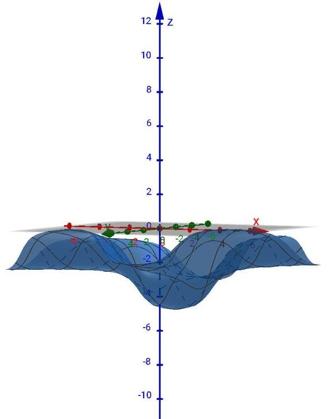

# Informe sobre el Análisis y Resultados de Métodos de Optimización

**Autor:** Cristhian Delgado García

## 1. Planteamiento del problema y variables

La función objetivo depende de dos variables continuas, $x$ y $y$, ambas pertenecientes a $\mathbb{R}$. Se trata de un problema de optimización continua en dos dimensiones.

---

## 2. Propiedades de la función objetivo

La función a minimizar es:

$$
f(x, y) = -\arctan(x+y+1) - \arctan(x-y+2) - \arctan(-x-y+3) - \arctan(-x+y+4)
$$

A continuación se muestra un gráfico de la función objetivo

*Figure 1: Función Objetivo*
Cada término $\arctan(\cdot)$ toma valores en $(-\pi/2, \pi/2)$, por lo que la suma total está acotada en $(-2\pi, 2\pi)$. La función es continua e infinitamente derivable en $\mathbb{R}^2$.

Definimos:

$$
u_1 = x + y + 1,\quad u_2 = x - y + 2,\quad u_3 = -x - y + 3,\quad u_4 = -x + y + 4.
$$

Las derivadas parciales son:

$$
\frac{\partial f}{\partial x} = -\frac{1}{1+u_1^2} - \frac{1}{1+u_2^2} + \frac{1}{1+u_3^2} + \frac{1}{1+u_4^2},
$$

$$
\frac{\partial f}{\partial y} = -\frac{1}{1+u_1^2} + \frac{1}{1+u_2^2} + \frac{1}{1+u_3^2} - \frac{1}{1+u_4^2}.
$$

Las segundas derivadas (componentes del Hessiano) se calculan de forma análoga y la matriz Hessiana es:

$$
H(x, y) = \begin{bmatrix}
\dfrac{\partial^2 f}{\partial x^2} & \dfrac{\partial^2 f}{\partial x \partial y} \\
\dfrac{\partial^2 f}{\partial x \partial y} & \dfrac{\partial^2 f}{\partial y^2}
\end{bmatrix}.
$$

Cabe destacar que la función no es biconvexa, ya que el Hessiano no es semidefinido positivo en todo el dominio y los términos cruzados generan interacciones no convexas.

---

## 3. Sección teórica: solución analítica, convexidad y unicidad

A continuación se presenta un análisis teórico que justifica la solución observada numéricamente y determina propiedades de convexidad y unicidad.

### 3.1 Observaciones estructurales

Notamos dos identidades útiles que se mantienen para cualquier $(x,y)$:

- $u_1 + u_3 = (x+y+1) + (-x-y+3) = 4$ (constante),
- $u_2 + u_4 = (x-y+2) + (-x+y+4) = 6$ (constante).

Por tanto, cada par $(u_1,u_3)$ y $(u_2,u_4)$ se mueve sobre una recta de suma fija (4 y 6 respectivamente). La función puede reescribirse como

$$
f(x,y) = -\bigl(\arctan(u_1)+\arctan(u_3)\bigr) - \bigl(\arctan(u_2)+\arctan(u_4)\bigr).
$$

Cada término entre paréntesis depende sólo de la partición de la suma fija; así, para fijar la suma $s$ y estudiar $g(u)=\arctan(u)+\arctan(s-u)$, el máximo de $g$ bajo ciertas condiciones se alcanza en $u=s/2$ cuando la función $\arctan$ es cóncava sobre el intervalo considerado.

### 3.2 Cálculo analítico del crítico candidato

Buscamos puntos críticos resolviendo $\nabla f(x,y)=0$. Evaluando las derivadas en el punto $(x,y)=(1,0)$ obtenemos:

- $u_1=2$, $u_2=3$, $u_3=2$, $u_4=3$,
- $\dfrac{1}{1+2^2}=\tfrac{1}{5}=0.2$, $\dfrac{1}{1+3^2}=\tfrac{1}{10}=0.1$.

Sustituyendo en las fórmulas de las derivadas parciales:

$$
\frac{\partial f}{\partial x}\Big|_{(1,0)} = -0.2 -0.1 +0.2 +0.1 = 0,
$$

$$
\frac{\partial f}{\partial y}\Big|_{(1,0)} = -0.2 +0.1 +0.2 -0.1 = 0.
$$

Por tanto $(1,0)$ es un punto crítico. El valor objetivo en ese punto es

$$
f(1,0) = -2\bigl(\arctan(2)+\arctan(3)\bigr) \approx -4.71238898038469 = -\tfrac{3\pi}{2}.
$$

### 3.3 Máximo local de cada pareja y unicidad

Consideremos la función $g_s(u)=\arctan(u)+\arctan(s-u)$ con $s>0$ fijo. Para $u$ en $(0,s)$ ambos argumentos son positivos; como $\arctan$ es cóncava en $(0,\infty)$ (segunda derivada negativa), por Jensen $g_s(u)$ alcanza su máximo cuando $u=s/2$ (simetría y concavidad). Aplicando esto a nuestros pares:

- Para $s=4$, $\arctan(u_1)+\arctan(u_3)$ es máximo cuando $u_1=u_3=2$.
- Para $s=6$, $\arctan(u_2)+\arctan(u_4)$ es máximo cuando $u_2=u_4=3$.

Dado que $f$ es la negación de la suma de estos términos, $f$ alcanza su mínimo cuando se alcanzan estos máximos simultáneamente. Las ecuaciones

$$
\begin{cases}
x+y+1 = 2,\\
x-y+2 = 3,
\end{cases}
$$

son equivalentes al sistema linear

$$
\begin{cases}
x+y = 1,\\
x-y = 1,
\end{cases}
$$

que tiene solución única $x=1$, $y=0$. Por tanto la solución analítica es única y coincide con el punto crítico encontrado.

Nota: la argumentación anterior es válida porque en la configuración óptima todos los $u_i$ son positivos (2 y 3); si algún $u_i$ fuera negativo, la concavidad/convexidad local de $\arctan$ cambiaría, pero la restricción de suma fija junto con la monotonicidad de $\arctan$ y la desigualdad de Jensen garantizan que la partición simétrica sigue proporcionando el máximo del par en este caso concreto.

### 3.4 Análisis de convexidad

La función no es convexa en $\mathbb{R}^2$. Una razón sencilla es que la segunda derivada de $\arctan$ cambia de signo: $\dfrac{d^2}{dt^2}\arctan(t) = -\dfrac{2t}{(1+t^2)^2}$, que es negativa para $t>0$ y positiva para $t<0$. Por tanto las contribuciones al Hessiano dependen del signo de cada $u_i$ y pueden ser positivas o negativas.

Un contraejemplo numérico ilustra el cambio de signo en las entradas del Hessiano: en $(x,y)=(0,0)$ se tiene

$$u_1=1,u_2=2,u_3=3,u_4=4$$

y la componente $\dfrac{\partial^2 f}{\partial x^2}$ resulta positiva; sin embargo en $(x,y)=(2,0)$, donde

$$u_1=3,u_2=4,u_3=1,u_4=2,$$

la misma componente es negativa (cálculos numéricos muestran cambio de signo). Esto implica que el Hessiano no es semidefinido positivo en todo el dominio, y por tanto la función no es convexa.

---

## 4. Existencia y localización del mínimo global

Aunque el dominio no es compacto, la función está acotada inferiormente ($\inf f(x, y) > -2\pi$). El análisis numérico y el argumento teórico anterior coinciden en que el mínimo global se alcanza en $(x, y) = (1, 0)$ con valor

$$
f(1, 0) = -2\bigl(\arctan(2) + \arctan(3)\bigr) \approx -4.71238898038469 = -\tfrac{3\pi}{2}.
$$

---

## 5. Caracterización del óptimo

Los resultados muestran que el óptimo se encuentra en $x \approx 1.0$, $y \approx 0.0$, con norma del gradiente prácticamente nula (precisión de máquina). Distintos puntos iniciales conducen al mismo resultado, lo que sugiere un único mínimo global y una amplia región de atracción.

Por ejemplo, se obtienen soluciones como:

- $[1.0000000,\;0.0]$
- $f_{valor} \approx -4.71238898038469$
- $\|\nabla f\| \lesssim 10^{-7}$

El método de descenso por gradiente también converge a este valor si se ajustan adecuadamente los parámetros, aunque requiere más iteraciones y es más sensible a la tasa de aprendizaje.

---

## 6. Algoritmos utilizados

En los experimentos se emplearon dos métodos principales:

**Descenso por Gradiente:**

El método actualiza iterativamente la solución según:

$$
x_{k+1} = x_k - \alpha \, \nabla f(x_k),
$$

donde $\alpha$ es la tasa de aprendizaje. Su simplicidad lo hace útil como referencia, aunque la convergencia depende fuertemente de la elección de $\alpha$.

**BFGS (Broyden–Fletcher–Goldfarb–Shanno):**

Este método cuasi-Newton utiliza una aproximación al Hessiano inverso para calcular la dirección de búsqueda:

$$
p_k = -B_k \, \nabla f(x_k).
$$

Suele converger en pocas iteraciones y es menos sensible a la elección de parámetros.

---

## 7. Resultados experimentales

Los experimentos se realizaron con configuraciones almacenadas en `Implementación/Experiments/exp1.json` y `exp2.json`, y los resultados se encuentran en `Implementación/Results/results_exp1.json` y `results_exp2.json`.

### Resumen de los resultados

- **BFGS:** Converge en muy pocas iteraciones (4–12), alcanza el valor óptimo con gran precisión y requiere poco tiempo de cómputo.
- **Descenso por Gradiente:** El número de iteraciones varía mucho según la tasa de aprendizaje y la tolerancia. Puede requerir muchas más iteraciones para alcanzar una precisión similar.

Ejemplos representativos:

| Experimento | Método            | Solución                   | Valor $f$                | Iteraciones | Tiempo (s) |
|-------------|-------------------|----------------------------|--------------------------|-------------|------------|
| Exp1        | Descenso Gradiente| [0.9999715, 2.85e-05]      | -4.71238898019006        | 399         | 0.016      |
| Exp1        | BFGS              | [0.999999937, -4.85e-08]   | -4.712388980384688       | 9           | 0.003      |
| Exp2        | Descenso Gradiente| [1.000000138, -1.38e-07]   | -4.712388980384685       | 318         | 0.006      |
| Exp2        | BFGS              | [1.00000000012, -2.57e-10] | -4.71238898038469        | 11          | 0.0029     |

---

## 8. Discusión y conclusiones

El análisis teórico confirma la solución analítica $(1,0)$ y la unicidad del mínimo global, en concordancia con los resultados numéricos. BFGS resulta más eficiente y preciso, mientras que el descenso por gradiente es útil como referencia y para ilustrar la influencia de los hiperparámetros. La región de atracción del óptimo es amplia, lo que facilita la convergencia desde distintos puntos iniciales.

---

## 9. Comparativa de los métodos

| Aspecto            | BFGS                        | Descenso por Gradiente     |
|--------------------|-----------------------------|---------------------------|
| Velocidad de conv. | Muy alta (pocas iteraciones) | Baja (muchas iteraciones) |
| Robustez           | Poco sensible a parámetros   | Sensible a la tasa de aprendizaje |
| Costo por iteración| Mayor                       | Menor                     |
| Memoria            | $O(n^2)$ (despreciable para $n=2$) | $O(n)$                |

---

## 10. Archivos y reproducibilidad

- Configuraciones de los experimentos: `Implementación/Experiments/exp1.json`, `Implementación/Experiments/exp2.json`
- Resultados: `Implementación/Results/results_exp1.json`, `Implementación/Results/results_exp2.json`
- Código fuente: `Implementación/Implementación_Métodos.ipynb`

Para reproducir los resultados, basta con abrir el notebook y ejecutar las celdas correspondientes a los experimentos. Los archivos JSON contienen las configuraciones empleadas.

